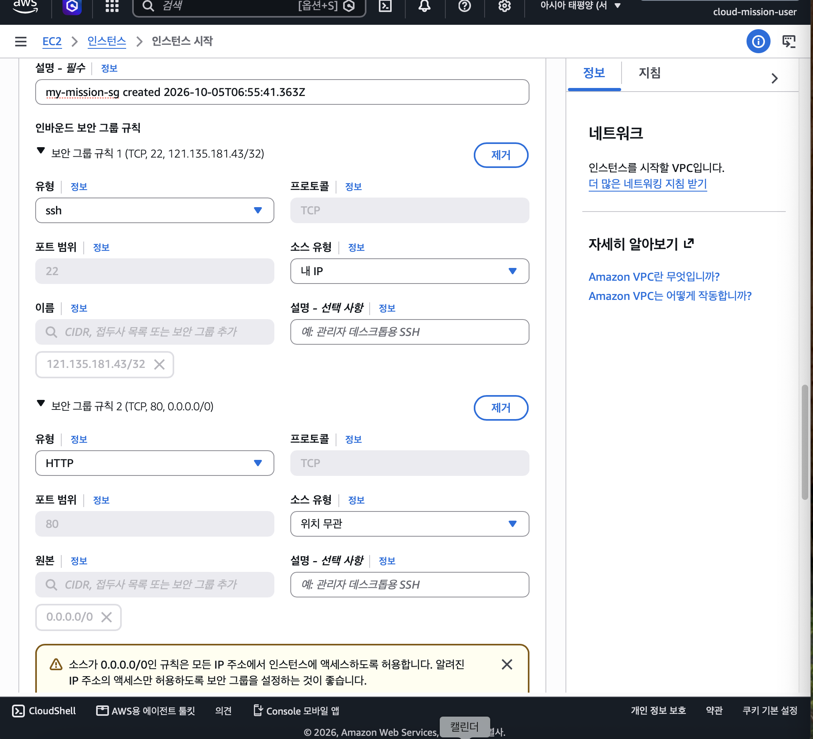
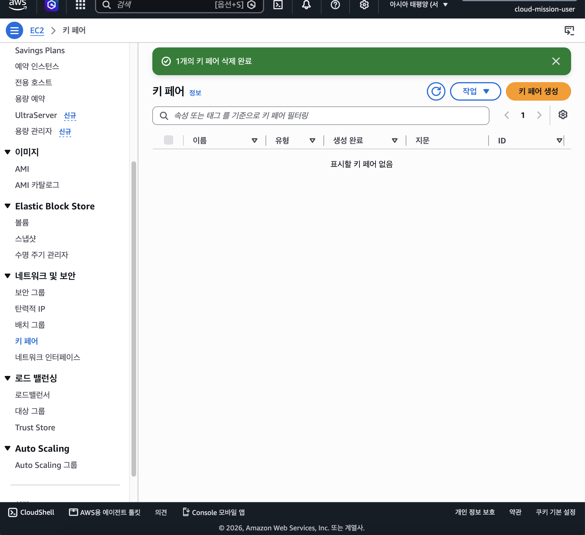
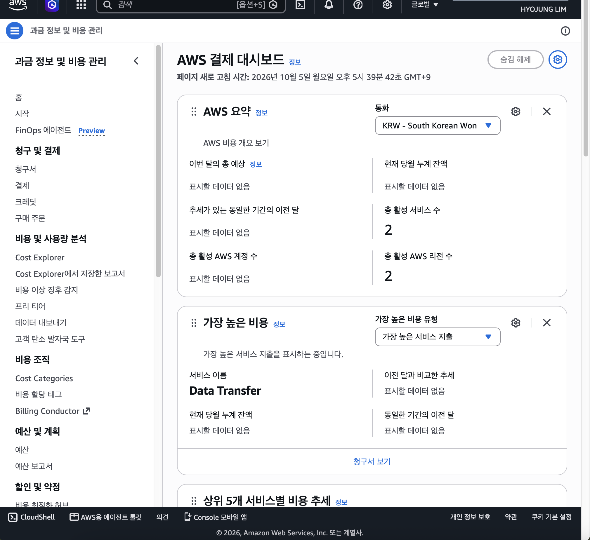

# cloud-mission

## 제출물

### 아키텍쳐 다이어그램

- 제출 최소 규격 : docs/architecture.png
(https://github.com/gittul-123/cloud-mission/blob/main/docs/architecture.png)


### 웹 서비스 외부 접속 증빙

- 방식 1개를 선택해 외부에서 접속을 검증한다
- 선택 방식 : (A) 브라우저 접속
- URL : http://43.203.154.65/ 
- 제출 최소 규격: docs/access-screenshot.png
(https://github.com/gittul-123/cloud-mission/blob/main/docs/access-screenshot.png)


### 트러블슈팅 보고서 1개

- 제출 최소 규격 : docs/troubleshooting.md
(https://github.com/gittul-123/cloud-mission/blob/main/docs/troubleshooting.md)

### 리소스 정리 체크리스트 1개

- 제출 최소 규격 : docs/cleanup-checklist.md
(https://github.com/gittul-123/cloud-mission/blob/main/docs/cleanup-checklist.md)


## 설계 요약

**네트워크 / 라우팅**
Public Subnet(`10.0.1.0/24`)의 Route Table(`public-rt`)에는 `0.0.0.0/0 → Internet Gateway` 경로를 명시적으로 연결했다. 이 경로가 없으면 EC2에 Public IP가 있어도 실제로 외부와 트래픽을 주고받을 수 없기 때문에, VPC 내부 통신(`10.0.0.0/16 → local`)과 별개로 반드시 필요하다.

**보안 그룹 (Security Group)**
인바운드는 두 규칙만 허용했다.
- HTTP(80): `0.0.0.0/0` — 웹 서비스는 누구나 접근 가능해야 하므로 전체 공개
- SSH(22): 학습자 개인 공인 IP `/32` — 서버 관리용 포트는 관리자만 접근해야 하므로 최소 범위로 제한

`0.0.0.0/0`에 대한 전체 포트(0-65535) 허용 규칙은 생성하지 않았다.

**IAM 최소 권한**
실습용 IAM 사용자(`cloud-mission-user`)에는 `AmazonEC2FullAccess`, `AmazonVPCFullAccess`만 연결했다. `AdministratorAccess`는 부여하지 않았으며, S3/RDS 등 실습과 무관한 서비스 권한도 부여하지 않았다. Security Group이 "네트워크 접근"을 통제한다면, IAM은 "AWS 리소스 관리 작업 권한"을 통제한다는 점에서 서로 다른 계층의 보안 경계다.

## 기능 요구사항 체크

1. 네트워크 구성

- VPC 1개 생성


- Public Subnet 1개 생성


- Internet Gateway -> VPC 연결


- 라우팅테이블 IGW 연결


2. 컴퓨트 및 웹 서버 배포
- Public Subnet에 EC2 인스턴스 1대를 생성


- 웹 서버(Nginx 등)를 설치하고 실행 상태 확인 
```
ubuntu@ip-10-0-1-73:~$ sudo apt install nginx -y
Installing:                     
  nginx

Installing dependencies:
  nginx-common

Suggested packages:
  fcgiwrap  nginx-doc  ssl-cert

Summary:
  Upgrading: 0, Installing: 2, Removing: 0, Not Upgrading: 186
  Download size: 666 kB
  Space needed: 1880 kB / 4664 MB available

Get:1 http://ap-northeast-2.ec2.archive.ubuntu.com/ubuntu resolute-updates/main amd64v3 nginx-common all 1.28.3-2ubuntu1.11 [37.9 kB]
Get:2 http://ap-northeast-2.ec2.archive.ubuntu.com/ubuntu resolute-updates/main amd64v3 nginx amd64 1.28.3-2ubuntu1.11 [628 kB]
Fetched 666 kB in 0s (12.8 MB/s)
Preconfiguring packages ...
Selecting previously unselected package nginx-common.
(Reading database ... 85303 files and directories currently installed.)
Preparing to unpack .../nginx-common_1.28.3-2ubuntu1.11_all.deb ...
Unpacking nginx-common (1.28.3-2ubuntu1.11) ...
Selecting previously unselected package nginx.
Preparing to unpack .../nginx_1.28.3-2ubuntu1.11_amd64v3.deb ...
Unpacking nginx (1.28.3-2ubuntu1.11) ...
Setting up nginx-common (1.28.3-2ubuntu1.11) ...
Created symlink '/etc/systemd/system/multi-user.target.wants/nginx.service' → '/usr/lib/systemd/system/nginx.service'.
Setting up nginx (1.28.3-2ubuntu1.11) ...
 * Upgrading binary nginx                                                [ OK ] 
Processing triggers for man-db (2.13.1-1build1) ...
Processing triggers for ufw (0.36.2-9build1) ...
Scanning processes...                                                           
Scanning linux images...                                                        

Running kernel seems to be up-to-date.

No services need to be restarted.

No containers need to be restarted.

No user sessions are running outdated binaries.

No VM guests are running outdated hypervisor (qemu) binaries on this host.```
```
```
sudo systemctl status nginx
● nginx.service - A high performance web server and a reverse proxy server
     Loaded: loaded (/usr/lib/systemd/system/nginx.service; enabled; preset: en>
     Active: active (running) since Mon 2026-10-05 07:30:43 UTC; 42s ago
 Invocation: 819d24aafd02417cbb027702b0c477af
       Docs: man:nginx(8)
    Process: 1780 ExecStartPre=/usr/sbin/nginx -t -q -g daemon on; master_proce>
    Process: 1782 ExecStart=/usr/sbin/nginx -g daemon on; master_process on; (c>
   Main PID: 1811 (nginx)
      Tasks: 3 (limit: 627)
     Memory: 3M (peak: 7M)
        CPU: 43ms
     CGroup: /system.slice/nginx.service
             ├─1811 "nginx: master process /usr/sbin/nginx -g daemon on; master>
             ├─1814 "nginx: worker process"
             └─1815 "nginx: worker process"

Oct 05 07:30:43 ip-10-0-1-73 systemd[1]: Starting nginx.service - A high perfor>
Oct 05 07:30:43 ip-10-0-1-73 systemd[1]: Started nginx.service - A high perform>
```

- 인스턴스에서 curl <http://localhost > 요청이 200 응답을 반환 확인
```
curl http://localhost
<!DOCTYPE html>
<html>
<head>
<title>Welcome to nginx!</title>
<style>
html { color-scheme: light dark; }
body { width: 35em; margin: 0 auto;
font-family: Tahoma, Verdana, Arial, sans-serif; }
</style>
</head>
<body>
<h1>Welcome to nginx!</h1>
<p>If you see this page, the nginx web server is successfully installed and
working. Further configuration is required.</p>

<p>For online documentation and support please refer to
<a href="http://nginx.org/">nginx.org</a>.<br/>
Commercial support is available at
<a href="http://nginx.com/">nginx.com</a>.</p>

<p><em>Thank you for using nginx.</em></p>
</body>
</html>
```
```
curl -o /dev/null -s -w "%{http_code}\n" http://localhost
200

```

3. 접근 제어
- HTTP(80)는 0.0.0.0/0 에서 접근 가능해야 한다.
- SSH(22)는 학습자 개인 IP(또는 지정된 IP 대역)에서만 접근 가능해야 한다.
- 0.0.0.0/0 에 대해 전체 포트(0-65535) 허용 규칙은 생성하지 않는다.



4. IAM 생성 확인

5. 외부 접속 검증
- (A) 선택, 제출물 확인

6. 삭제
- [x] EC2 인스턴스 종료(Terminate) 확인 — `my-mission-server`
    
    
   
- [x] EBS 볼륨 삭제 확인 (미사용 볼륨 포함)
    
- [x] Elastic IP 확인 — 별도 할당하지 않았으므로 해당 없음 (자동 할당된 Public IPv4는 인스턴스 종료 시 자동 반환됨)

- [x] Security Group 삭제 확인 — `my-mission-sg`
    
    

- [x] Route Table 삭제 확인 — `public-rt` (서브넷 연결 해제 후 삭제)
    
    

- [x] Internet Gateway 분리(Detach) 및 삭제 확인 — `my-mission-igw`
    
    
    

- [x] Subnet 삭제 확인 — `public-subnet`
    s
    

- [x] VPC 삭제 확인 — `my-vpc`
    
    

- [x] NAT Gateway — 생성하지 않았으므로 해당 없음
- [x] ELB/ALB — 생성하지 않았으므로 해당 없음
- [x] RDS — 생성하지 않았으므로 해당 없음
- [x] Key Pair 삭제 확인 (선택) — `my-mission-key`
    
    
- [x] Billing Dashboard에서 과금 항목이 남지 않았는지 확인 (권장)
    


