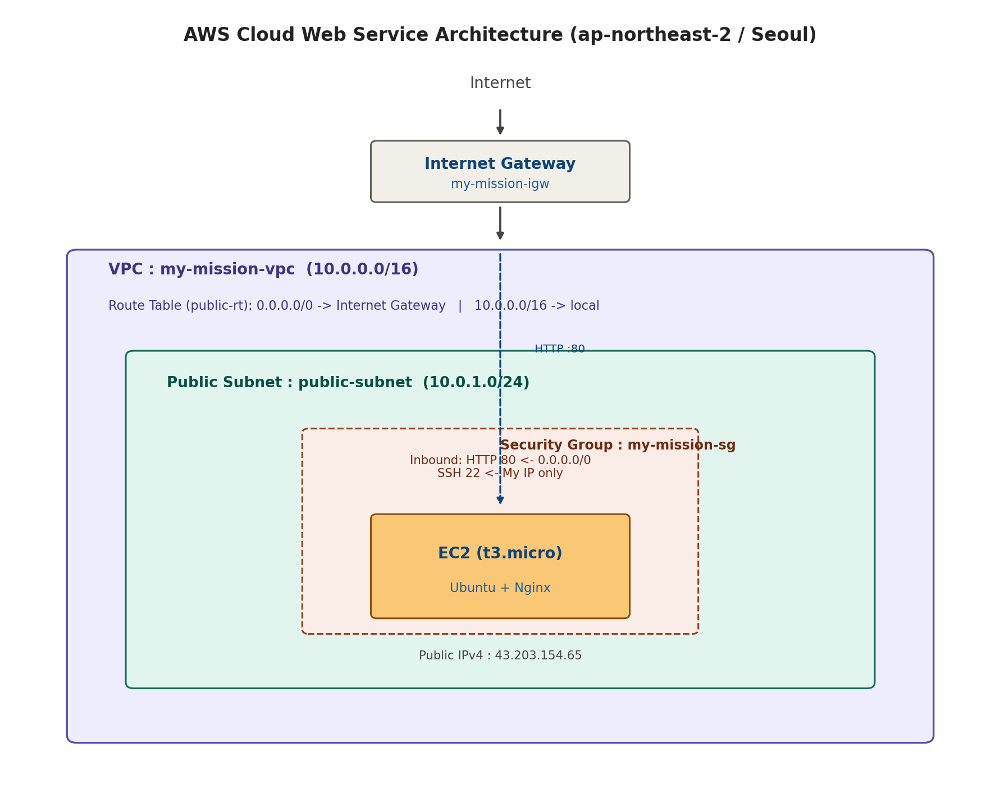
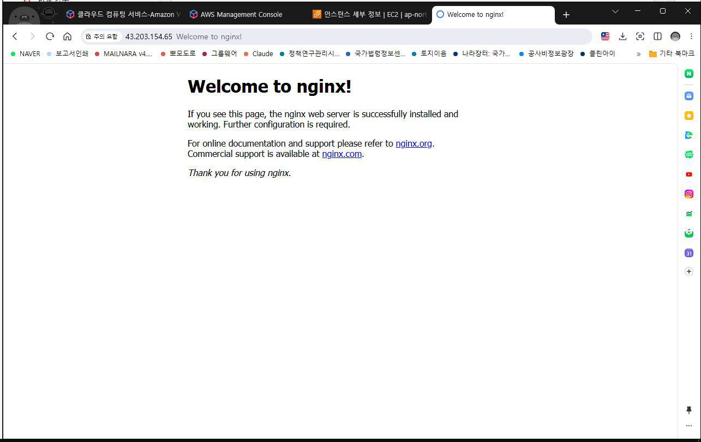

# cloud-mission

## 아키텍쳐 다이어그램

- 제출 최소 규격 : docs/architecture.png
(https://github.com/gittul-123/cloud-mission/blob/main/docs/architecture.png)

## 웹 서비스 외부 접속 증빙

- 방식 1개를 선택해 외부에서 접속을 검증한다
- 선택 방식 : (A) 브라우저 접속
- URL : http://43.203.154.65/ 
- 제출 최소 규격: docs/access-screenshot.png
(https://github.com/gittul-123/cloud-mission/blob/main/docs/access-screenshot.png.JPG)

## 트러블슈팅 보고서 1개

- 제출 최소 규격 : docs/troubleshooting.md
(https://github.com/gittul-123/cloud-mission/blob/main/docs/troubleshooting.md)

## 리소스 정리 체크리스트 1개

- 제출 최소 규격 : docs/cleanup-checklist.md
(https://github.com/gittul-123/cloud-mission/blob/main/docs/cleanup-checklist.md)

